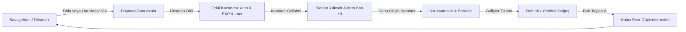

# ⚔️ Metin2 Idle RPG - Kapsamlı Proje Dokümantasyonu ve Geliştirici Kılavuzu

Bu doküman, **Metin2 Idle RPG** projesinin genel konseptini, yazılım mimarisini, teknik altyapısını, matematiksel formüllerini, state yönetimini (Zustand), veri modellerini ve UI/UX kararlarını en ince ayrıntısına kadar açıklamak üzere hazırlanmıştır. Projeye katkı sağlayacak tüm geliştiriciler ve yapay zeka asistanları için ana başvuru kaynağıdır.

---

## 📌 1. Proje Konsepti ve Temel Oyun Döngüsü (Game Loop)

**Metin2 Idle RPG**, efsanevi MMORPG oyunu Metin2'nin karanlık fantastik atmosferini ve bağımlılık yapıcı aşamalı (incremental) mekaniklerini web platformuna taşıyan boşta ilerleme (idle/clicker) oyunudur.

### Ana Oyun Döngüsü


1. **Savaş & Tıklama**: Oyuncu canavarlara tıklayarak tık hasarı vurabilir veya kuşanılan eşyalar ve statlardan gelen saniye başı otomatik hasar (Auto DPS) ile canavarları otomatik keser.
2. **Kazanım (Gold, EXP, Loot)**: Öldürülen her canavar altın ve tecrübe puanı (EXP) kazandırır. Şansa bağlı olarak canavarın seviyesi ve nadirliğine göre çanta (Bag) içerisine eşya (Loot) düşer.
3. **Gelişim (Demirci & Statlar)**: Seviye atladıkça can ve otomatik hasar artar. Kazanılan altınlar ile **Demirci (Blacksmith)** üzerinden eşyalar +9'a kadar basılabilir. **Başarısızlık durumunda eşya Metin2'deki gibi yok olur!**
4. **Rebirth & Kalıcı Güç**: 50. seviyeye ulaşıldığında oyuncu her şeyi sıfırlayıp **Ruh Taşı (Spirit Stone)** alarak **Yeniden Doğuş (Rebirth)** yapabilir. Bu taşlar ile kalıcı hasar/can çarpanları veren **Eser (Artifact)** yükseltmeleri yapılır.

---

## 🛠️ 2. Teknoloji Yığını (Tech Stack)

Proje modern, hızlı ve hatasız çalışan bir frontend mimarisi üzerine inşa edilmiştir:
- **Çekirdek Kütüphane**: [React 19](https://react.dev/) (Vite altyapısı ile son derece hızlı HMR ve derleme).
- **Programlama Dili**: [TypeScript 5/6](https://www.typescriptlang.org/) (Strict mode - sıfır runtime tipi belirsizliği, tam güvenli veri modelleri).
- **State Yönetimi**: [Zustand 5](https://github.com/pmndrs/zustand) (Geleneksel Redux'a kıyasla son derece hafif, multi-store mimarisi ile modüler ve performanslı).
- **Arayüz Tasarımı (CSS)**: [Tailwind CSS 3](https://tailwindcss.com/) (Özel tanımlanmış Metin2 renk paleti, karanlık tema gölgeleri ve dinamik hover animasyonları).
- **İkon Kütüphanesi**: [Lucide React](https://lucide.dev/) (Sade, modern ve hafif SVG ikon seti).

---

## 📁 3. Dosya ve Dizin Yapısı

Proje dosyaları modülerlik ve yüksek okunabilirlik gözetilerek organize edilmiştir:

```text
irlemvp/
├── .gemini/                     # AI Asistanı çalışma kayıtları ve görsel çıktılar
├── artifacts/                   # Projeye ait raporlar ve tasarım görsel kayıtları
├── src/
│   ├── components/              # Arayüzü oluşturan React bileşenleri
│   │   ├── Artifacts.tsx        # Rebirth sonrası kalıcı eserlerin listelendiği panel
│   │   ├── Blacksmith.tsx       # Eşya artı basma (RNG) paneli
│   │   ├── GameArea.tsx         # Düşman can barı, tıklama alanı ve aşama geçişleri
│   │   ├── Inventory.tsx        # Envanter ana paneli (InventoryPanel)
│   │   ├── InventoryFilter.tsx  # Envanter alt kategori butonları (Tümü, Silah vb.)
│   │   ├── InventorySlot.tsx    # Tekil eşya kartları, kuşanma ve satma hover menüleri
│   │   ├── PlayerStats.tsx      # Kahraman seviye, EXP, altın, HP ve istatistik kartı
│   │   └── Rebirth.tsx          # Yeniden doğuş onay ve ödül paneli
│   ├── game/                    # Statik veriler ve matematiksel motor
│   │   ├── items.ts             # Eşya havuzları, nadirlik oranları ve bonus hesaplamaları
│   │   └── math.ts              # Seviye EXP, Demirci RNG şansı ve canavar stat formülleri
│   ├── store/                   # Zustand Store'ları (State Management)
│   │   ├── artifactStore.ts     # Kalıcı Eser verileri ve geliştirme aksiyonları
│   │   ├── combatStore.ts       # Savaş döngüsü, canavarlar ve aşamaları yöneten store
│   │   ├── inventoryStore.ts    # Çanta, kuşanılmış eşyalar ve demirci yükseltme mantığı
│   │   ├── playerStore.ts       # Oyuncu seviyesi, altın, can, hasar ve statların store'u
│   │   └── systemStore.ts       # Ana oyun döngüsü tick'leri ve Base64 şifreli save/load
│   ├── types/                   # Ortak TypeScript tip tanımlamaları
│   │   └── index.ts             # Item, Enemy, Player, Artifact arayüz tanımları (Interfaces)
│   ├── utils/                   # Yardımcı araçlar
│   │   └── numberFormat.ts      # K, M, B, T (Bin, Milyon, Milyar) gibi sayı kısaltıcılar
│   ├── App.tsx                  # Ana düzen (Layout) ve store başlatıcı wrapper
│   ├── index.css                # Global Tailwind yönergeleri ve ince altın scrollbar kodları
│   └── main.tsx                 # React DOM render giriş noktası
├── agent.md                     # AI entegrasyonu ve geçmiş değişikliklerin kayıt kütüğü
├── package.json                 # Bağımlılık paketleri ve NPM script tanımları
├── tsconfig.json                # TypeScript derleyici konfigürasyonu
└── vite.config.ts               # Vite build ve server ayarları
```

---

## 💾 4. Eyalet Yönetimi (Zustand Multi-Store Mimarisi)

Uygulamanın durumu tek bir devasa store yerine birbirleriyle haberleşen **5 bağımsız Zustand Store**'una bölünmüştür. Bu sayede sadece değişen bileşenler yeniden çizilir (re-render) ve yüksek FPS performansı korunur.

### 4.1. `playerStore.ts` (Kahraman Durumu)
Oyuncunun anlık RPG istatistiklerini ve seviyesini tutar.
- **State**: `level`, `exp`, `maxExp`, `gold`, `spiritStones`, `currentHp`, `maxHp`, `hpRegen`, `defense`, `critChance`, `critDamage`, `blockChance`.
- **Formül Entegrasyonu**: Envanterde kuşanılan eşyalar ve kalıcı eserler değiştikçe `recalculateStats` fonksiyonu tetiklenerek oyuncunun hasar, savunma ve can yenileme değerleri anında yeniden hesaplanır.

### 4.2. `combatStore.ts` (Savaş & Aşama Durumu)
Oyunun PvE savaş motorunu çalıştırır.
- **State**: `currentStage`, `highestStage`, `killsInStage` (her aşamada 10 canavar öldürülmelidir), `enemy` (anlık canavar verisi), `isRespawning` (oyuncu öldüğünde devreye giren ceza/yeniden doğma süresi).
- **Mantık**: Canavar öldüğünde otomatik olarak altın ve EXP oyuncuya eklenir. Şansa bağlı olarak envantere rastgele eşya eklenmesi için `inventoryStore`'un düşürme metotları tetiklenir. Boss canavarları her 10 aşamada bir gelir.

### 4.3. `inventoryStore.ts` (Çanta & Ekipman Durumu)
RPG envanter sistemini ve demirciyi simüle eder.
- **State**: `items` (çantedeki eşyalar dizisi - maksimum 50 slot), `equipped` (kuşanılan eşyalar nesnesi: Silah, Zırh, Kask, Kalkan, Bilezik, Kolye).
- **Metotlar**: 
  - `equipItem(id)`: Eşyayı kuşanır, varsa eski eşyayı çantaya geri koyar ve kahraman statlarını günceller.
  - `unequipItem(type)`: Ekipmanı çıkarır.
  - `sellItem(id)`: Eşyayı nadirliğine ve seviyesine göre altına dönüştürür.
  - `upgradeItem(id)`: Demirci fonksiyonu. Altın harcar, şansı hesaplar. Başarılıysa seviyeyi `+1` artırır, başarısızsa eşyayı `items` dizisinden siler.

### 4.4. `systemStore.ts` (Ana Oyun Döngüsü & Kayıt Motoru)
Oyunu yaşatan kalptir.
- **Game Loop**: `setInterval` ile saniyede 10 kez (`100ms` aralıklarla) çalışarak saniye başı Auto DPS hasarını canavarlara uygular ve can yenilemelerini yapar.
- **Offline Progress (Çevrimdışı İlerleme)**: Oyuncu oyunda değilken geçen süreyi (Unix Timestamp farkı) hesaplar. Maksimum 12 saate kadar oyuncunun yokluğunda kazanacağı tahmini altın ve tecrübeyi (EXP) oyuna girişte hediye eder.
- **Base64 Şifreli Kayıt**: `localStorage` üzerine kaydederken doğrudan okunmasını zorlaştırmak için tüm veriyi JSON formatından Base64 dizesine dönüştürür.

### 4.5. `artifactStore.ts` (Rebirth Durumu)
Oyunu döngüsel olarak uzatan kalıcı aşamalı gelişim store'u.
- **State**: `artifacts` (seviyeleri ile birlikte kalıcı eser nesnesi).
- **Mantık**: Rebirth yapıldığında kahraman seviyesi 1'e çekilir, altınlar ve envanter sıfırlanır. Ancak kazanılan Ruh Taşları ile hasar çarpanları, altın kazanma çarpanı ve kritik şansı gibi değerler kalıcı olarak katlanır.

---

## 📈 5. Oyun Balansı ve Matematiksel Ölçekleme

Oyunun sonsuz döngüde tıkanmaması veya aşırı kolaylaşmaması için matematiksel formüller üstel (exponential) olarak tasarlanmıştır. Bu formüller `src/game/math.ts` içinde yer alır:

### 5.1. Tecrübe (EXP) İhtiyacı
Oyuncunun bir sonraki seviyeye geçmek için ihtiyaç duyduğu EXP miktarı her seviyede katlanarak artar:
$$\text{Max EXP} = 100 \times (1.15)^{\text{level} - 1} \times \text{level}$$
*Bu sayede ilk seviyeler hızlı geçilirken, 50. seviyeye ulaşmak stratejik envanter geliştirmesi gerektirir.*

### 5.2. Canavar Canı (HP) Ölçeklemesi
Aşamalar ilerledikçe canavarların canı ve gücü üstel olarak artar:
$$\text{Enemy Max HP} = 30 \times (1.22)^{\text{stage} - 1} \times \text{stage}$$
- **Boss Çarpanları**: Eğer canavar bir **Mini Boss** veya **Major Boss** ise, canı ve hasarı sırasıyla `x3` ve `x10` oranında çarpan alır.

### 5.3. Demirci (Blacksmith) Yükseltme Maliyet ve Şansları
- **Altın Maliyeti**: Eşya seviyesine ve artı değerine bağlı olarak katlanır:
  $$\text{Upgrade Cost} = \text{itemLevel} \times 100 \times (1.8)^{\text{upgradeLevel}}$$
- **Başarı Şansı**: Metin2 ruhunu yansıtacak şekilde artı yükseldikçe şans radikal olarak düşer:
  - $+0 \rightarrow +1$: $\%95$
  - $+4 \rightarrow +5$: $\%70$
  - $+8 \rightarrow +9$: $\%30$

---

## 💎 6. Eşya Sistemi ve Nadirlikler (Loot System)

Düşen her ekipmanın rengi ve gücü **7 farklı nadirlik (Rarity) derecesine** göre belirlenir. Nadirlik arttıkça eşyaya eklenen rastgele bonus sayısı ve güç çarpanı katlanır:

| Nadirlik (Rarity) | Düşme Şansı | Arayüz Rengi | Ekstra Özellik Çarpanı |
| :--- | :--- | :--- | :--- |
| **Common (Yaygın)** | $\%60.0$ | Gri / Gümüş | $1.0\times$ |
| **Uncommon (Sıradan)** | $\%25.0$ | Yeşil | $1.3\times$ |
| **Rare (Nadir)** | $\%10.0$ | Mavi | $1.8\times$ |
| **Epic (Destansı)** | $\%4.0$ | Mor | $2.5\times$ |
| **Legendary (Efsanevi)** | $\%0.8$ | Turuncu | $4.0\times$ + Hafif Parlama |
| **Mythic (Mistik)** | $\%0.18$ | Kırmızı | $6.0\times$ + Güçlü Parlama |
| **Godlike (Tanrısal)** | $\%0.02$ | Sarı (Animasyonlu) | $10.0\times$ + Nabız Parlaması |

### Dinamik Stat Oluşturma
Bir eşya düştüğünde türüne göre (`Weapon`, `Armor` vb.) stat havuzundan rastgele değerler alır. 
- Silahlar her zaman yüksek **ATK** ve **Kritik** verir.
- Zırhlar ve Kalkanlar yüksek **HP**, **Savunma (DEF)** ve **Bloklama (Block)** verir.
- Takılar ve Bilezikler ise **HP Yenileme (Regen)** ve **Kritik Hasar** odaklıdır.

---

## 🎨 7. UI/UX Tasarım Estetiği ve Yerleşim Düzeni

Arayüz tasarımı oyuncuyu eski Metin2 günlerine götürecek şekilde **Dark Gold / Deep Red** konsepti üzerine kurulmuştur.

### 7.1. Global 100vh Yerleşimi
Ekranın tamamı tek bir çerçeve içerisine hapsedilmiştir (`h-screen w-screen overflow-hidden`). 
- **Tarayıcı Kaydırma Çubuğu Yok**: Tarayıcının ana gövdesinde hiçbir şekilde kaydırma çubuğu çıkmaz. Bu sayede oyun, native bir masaüstü veya mobil oyun uygulaması hissi verir.
- **İçsel Bağımsız Scroll**: Sadece taşan dinamik alanlar (Sol kolondaki Demirci/Eser listesi ve Sağ kolondaki Çanta listesi) bağımsız olarak kendi içlerinde kayar.

### 7.2. Metin2 Temalı İnce Scrollbar Tasarımı
Tüm tarayıcıların varsayılan kaba kaydırma çubukları gizlenmiş ve CSS ile sıfırdan tasarlanmıştır:
- **Genişlik**: Son derece zarif `6px` ince görünüm.
- **Kanal (Track)**: `#0a0a0c` arka plan rengiyle tamamen arka plana yedirilmiş karanlık alan.
- **Bar (Thumb)**: `#d4af37` orijinal Metin2 Altın sarısı rengi. Üzerine gelindiğinde (hover) yumuşak geçişle hafif koyu mat altın sarısına (`#b5952f`) dönüşür.

### 7.3. Üç Sütunlu (Three-Column) Premium Düzen
Ekran yatayda 3 ana parçaya bölünmüştür:
1. **Sol Sütun (Hero & Upgrades)**: Karakterin anlık istatistikleri, seviyesi, EXP ve HP barları yer alır. Alt tarafında sekmeli geçiş ile **Demirci**, **Kalıcı Eserler (Artifacts)** ve **Rebirth** ekranlarına kolayca erişilir.
2. **Orta Sütun (Combat Arena)**: Savaşın döndüğü yerdir. Aşamayı (Stage) gösterir, ortadaki devasa interaktif kurukafa butonu düşmanı temsil eder ve tıklama efektleri burada oluşur. Altında düşmanın anlık can barı yer alır.
3. **Sağ Sütun (Equipment & Inventory)**: Üst tarafta kuşanılmış 6 ekipman slotu bulunur. Hemen altında **Envanter Kategori Filtresi** yer alır:
   - **Tümü**: Çantadaki tüm eşyaları gösterir.
   - **Silahlar**: Sadece silahları listeler.
   - **Zırhlar**: Zırh ve kaskları filtreler.
   - **Kalkanlar**: Sadece kalkanları gösterir.
   - **Takılar**: Bilezik ve aksesuarları getirir.
   En alt kısımda ise filtreye göre anlık güncellenen çantadaki eşya ızgarası (CSS Grid) yer alır.

---

## 🚀 8. Gelecek Geliştirme Yol Haritası (Roadmap)

Projenin altyapısı aşağıdaki özelliklerin kolayca entegre edilebileceği şekilde son derece esnek tasarlanmıştır:
1. **Aktif Beceriler (Skills System)**: Hamle, Hava Kılıcı gibi Metin2 becerilerinin cooldown ve mana barı ile oyun döngüsüne eklenmesi.
2. **Metin Taşları**: Belirli aşamalarda düşen devasa Metin Taşları ve içlerinden çıkan nadir kitaplar/taşlar.
3. **Zindan Sistemi (Dungeons)**: Şeytan Kulesi (Demon Tower) veya Örümcek Zindanı gibi kat bazlı, süre sınırına sahip özel boss mücadele alanları.
4. **Çevrimiçi Liderlik Tablosu (Leaderboard)**: Oyuncuların ulaştığı en yüksek seviye veya aşamaya göre sıralandığı hafif bir API entegrasyonu.
